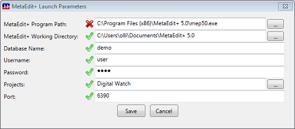

# How the extension works

This page contains information about how the extension works, and how to modify or extend it for your own use. The source code is available from [here](http://graphbrowser.codeplex.com/SourceControl/list/changesets).

## Launching the extension

When the extension starts it will search for an existing open API connection to {"MetaEdit+. If it finds one, it will ask for all the graphs in all opened projects in MetaEdit+ and show them in the view. If the extension doesn’t find an API connection it will look in the directory of the Visual Studio Projects folder a settings file, ‘default.mer’, that contains MetaEdit+ launch parameters. If it finds the settings file, the extension asks the user's permission to launch MetaEdit+, log in, open projects and start the API server in MetaEdit+."}

When using the extension for first time there is no settings file and no open API connection to {"MetaEdit+. In this case the extension tries to calculate the values that are needed for launching MetaEdit+ and shows them in a dialog to user. When the user has checked and edited them if needed, MetaEdit+ can be launched by clicking the ‘Open MetaEdit+’ button. The launch parameters are also saved in the ‘default.mer’ file in the Visual Studio Projects folder, and will be read when the extension is next launched without an API connection."}

Below you can see a state diagram showing the extension initialization process. 

## The generation and import process

The generation and import process contains stages in which the extension writes a plugin.ini file for {"MetaEdit+, a generator for the selected graph is run in MetaEdit+, the generated Visual Studio solution (if any) is imported in Visual Studio, opened, built and launched in Visual Studio automatically. Let's look next at the individual states in more detail. You may also test these by running the 'Digital Watch' example available in MetaEdit+."}

In the first stage a plugin.ini file for {"MetaEdit+ is written in the MetaEdit+ working directory. Once the user has chosen to run a generator the file is created. The plugin.ini file contains information from the application (Visual Studio in this case) that calls MetaEdit+. It also contains the Visual Studio projects folder path in which the MetaEdit+ generator is supposed to generate the source code files. Below you can see an example of the plugin.ini file content."}
{{
  IDE=visualstudio
  workspace=C:\user\Documents and settings\Visual Studio 2010\Projects\
}}
The file and its content allow the generator in {"MetaEdit+ to see that it is being used from another program. The generator can thus change its behaviour, e.g. instead of compiling and opening generated code itself, it can just generate the source code and project resource files that are needed for importing and building the solution in Visual Studio. The extension removes the plugin.ini file at the end of the process."}

After {"MetaEdit+ has generated the source code files, the extension looks for a Visual Studio solution with the same name as the graph selected in the plugin tree view. If a solution is found, it is imported into Visual Studio and opened. After that the solution is built and run, so the user can go straight to seeing the generated program running."}

The solution import automates otherwise manual actions like choosing to create a new solution from the File menu and going through the wizard to create a new project. While these actions could be left for the user, the extension aims to automate integration between code generated from {"MetaEdit+ and Visual Studio. To provide this automation the MetaEdit+ generator creates Visual Studio solution resource files that are needed for opening the solution in Visual Studio, and the Visual Studio extension provides the solution import, build and launch commands."}

## Writing your own generator

The most common scenario for the extension is for the generated source code to end up in an Visual Studio solution and be compiled and run from there. To do that, the extension and generator must work together, following this interface: 

* Name the generator 'Autobuild'
* Read the Visual Studio project directory from the plugin.ini file created by the extension
* Generate the source files under that directory
* Generate an Visual Studio solution and project file in the directories, with the same name as the graph, and referring to the generated source code

## Extending the extension

You can easily modify the extension to add extra functions that you'd like, or to change the existing behaviour. {"MetaEdit+ commands, for example commit and abandon or editing the graphs programmatically, are available via the API similarly to the commands that are used in this plugin. For more information, see the API section in the MetaEdit+ manual and the"} [source code](http://graphbrowser.codeplex.com/SourceControl/list/changesets) of this plugin.