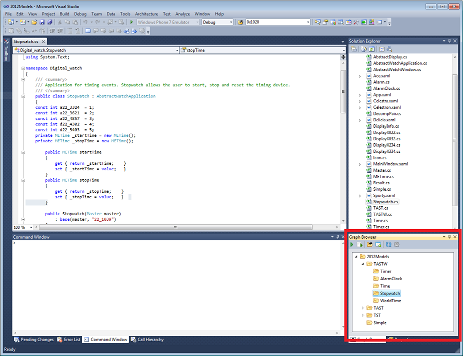

# Getting started

When you have Visual Studio, MetaEdit+ and the extension [installed](InstallingInstructions.md), run Visual Studio. To open the extension click from toolbar **View | Other Windows | Graph Browser**.

The Graph Browser extension tries to connect to the MetaEdit+ API server at startup. If it doesn't find any available connection, it will offer to launch MetaEdit+, start the API server, and login to the repository. This needs some paths and other parameters, which are stored in a 'default.mer' file that is saved in the root of the Visual Studio Projects folder in users My Documenst folder.

When running the extension for the first time there is no 'default.mer' file. In this case the extension tries to find and suggest the correct paths needed for launching MetaEdit+. It shows them to user who can edit and accept them by clicking 'Open MetaEdit+'. Accepting them will open MetaEdit+. If the plugin doesn't show any models after starting MetaEdit+ and its API, try clicking the 'Update Graph List' icon on the plugin's toolbar.

When running, the extension will show the hierarchy of your models from MetaEdit+. The figure below shows the extension listing the 'Digital watch' example models in Visual Studio.

Since MetaEdit+ 5.0, the Digital Watch example has been updated to show the extensions ability to import generated code into a Visual Studio as Visual C# solution. To see this:
* Select the top-level graph in the plugin
* Choose **Edit Graph Properties** from the pop-up menu and set the **Generation target platform** to **C#: Windows** or **C#: API**
* Press the extensions Run Autobuild toolbar button.
